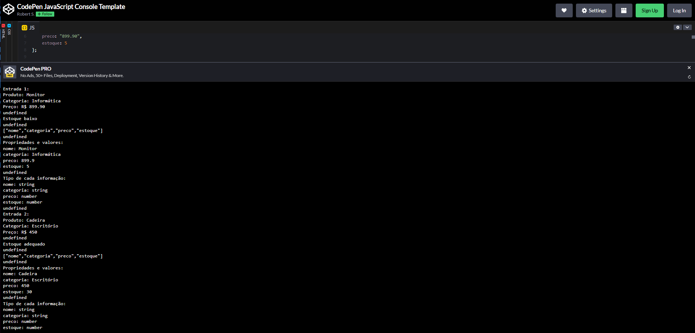
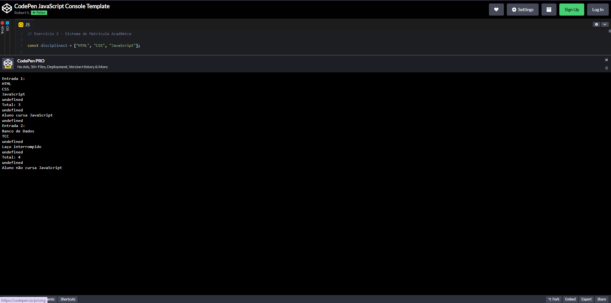
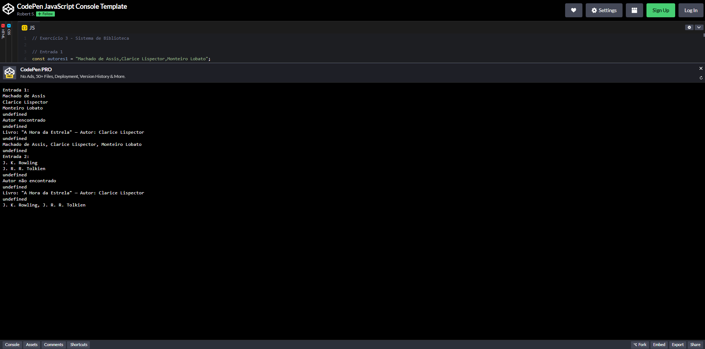
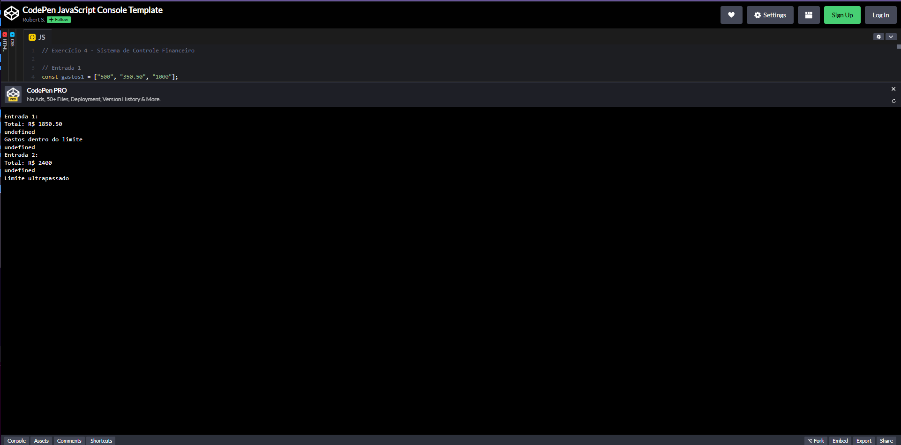
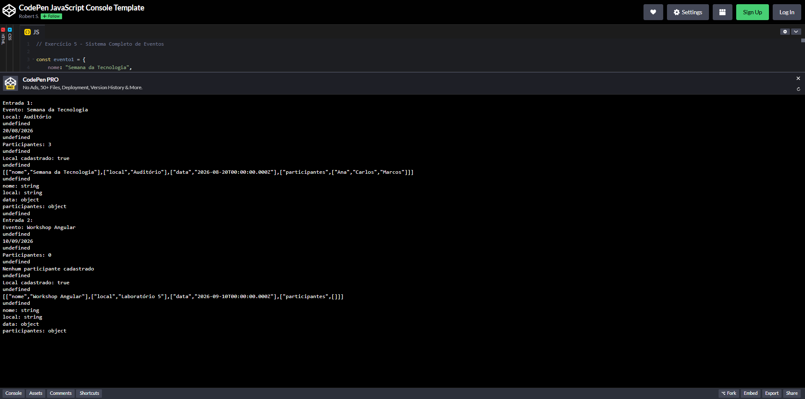

# Atividade JavaScript

Atividade prática desenvolvida para a disciplina de **Desenvolvimento Web**, aplicando os conceitos estudados nas aulas 15 a 18.

---

## Estrutura do repositório

```
atividade-javascript/
├── img/
│   ├── exercicio_js1.png
│   ├── exercicio_js2.png
│   ├── exercicio_js3.png
│   ├── exercicio_js4.png
│   └── exercicio_js5.png
├── exercicio1.js
├── exercicio2.js
├── exercicio3.js
├── exercicio4.js
├── exercicio5.js
└── README.md
```

---

## Exercícios

### Exercício 1 — Sistema de Cadastro de Produtos

Sistema que cadastra produtos com nome, categoria, preço e estoque. Converte e valida o preço, informa o status do estoque e exibe as propriedades e tipos do objeto.



---

### Exercício 2 — Sistema de Matrícula Acadêmica

Sistema que controla disciplinas de um aluno. Percorre o array com `for`, usa `continue` para ignorar disciplinas vazias e `break` ao encontrar "TCC".



---

### Exercício 3 — Sistema de Biblioteca

Sistema que recebe autores separados por vírgula, converte para array, verifica a existência de um autor e exibe um registro de livro com Template Literal.



---

### Exercício 4 — Sistema de Controle Financeiro

Sistema que soma gastos mensais em formato texto, ignorando valores inválidos, e informa se o total ultrapassou R$ 2.000.



---

### Exercício 5 — Sistema Completo de Eventos

Sistema de eventos com objeto contendo data, local e participantes. Exibe data formatada, verifica participantes e exibe propriedades e tipos do objeto.



---

*Aluna: Vitória Gabrieli — Turma: 144-1BN*
*Disciplina: Desenvolvimento Web — Profª Sabrina B. Moreira*
